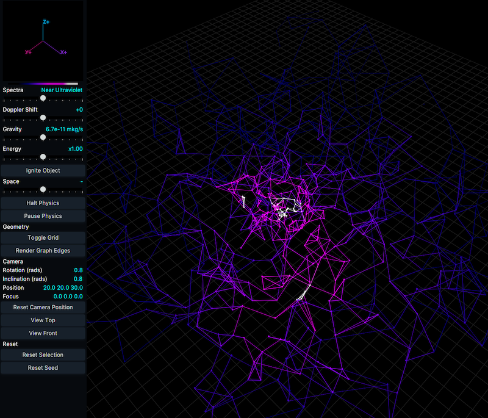

# N-Body Simulation / Data Viz for Astral Spectra

Color scheme vizualization built as an n-body simulation, 
populating a bunch of physics-enabled (incl. radiation) nodes in navigable, interactive 3D space. 
Node coloring is based on radiation from star-like nodes, and applied from color 
schemes as representations of electro-magnetic radiation classes, atomic spectra,
and other effects.

#### Features
 - Gravity slider
 - Radiation output slider
 - Doppler shift slider (unimplemented)
 - Node ignition to star
 - Halt/pause physics
 - Space expansion/collapse
 - Camera positioning context and movement (WASD, arrow keys)
 - Node selection and positioning context
 - Completely arbitrary graph-edge generating rules for cool visual effect

#### Color schemes
Some artistic liberty has been taken with representing the color schemes. Most schemes
map colors from hot to cold, but the emission spectra schemes are reversed. Stellar
classification is a simple overlay.

 - Long-infrared
 - Mid/thermal infrared
 - Near-Infrared
 - Long-wave Ultraviolet
 - Ultraviolet
 - UV Filter
 - Hydrogen emission spectra
 - Nitrogen emission spectra
 - Stellar classification
 
 
#### About this project
Not under further development because this was just a way to try out Java, 
GUI/vector graphics dev, and physics programming. Look for a Python version in the 
future to improve on everything here.

#### Credit
JavaTutorials101 for their 3D from scratch tutorial, which I used to inform the graphics rendering engine.

